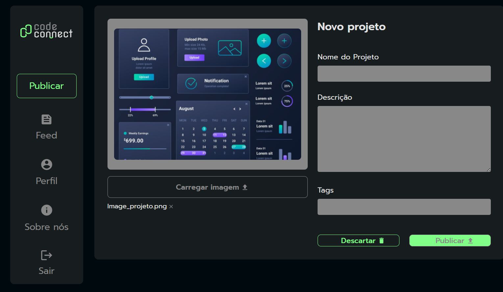

# Code Connect

## ℹ️ Sobre

Projeto utilizado no curso para aprendizado das técnicas e melhores práticas.

## 📘Ementa

### JavaScript: entendendo promises e async/await

- Aprender a gerenciar tarefas assíncronas com JavaScript
- Construir funções assíncronas com async/await
- Lidar com retornos de funções assíncronas com auxílio das Promises
- Implementar setTimeout para executar código assíncrono em momentos específicos
- Compreender técnicas para tratamento de erros em aplicações JavaScript
- Conhecer sobre o funcionamento do Event Loop, Call Stack e Task Queue

## 🖥️ Tecnologias

  
  
  

## 🧑‍🏫 Instrutor(es)

| [ Mônica Hillman](https://github.com/MonicaHillman) |
| :--------------------------------------------------------------------------------------------------------------------------------------------------------: |

## 💻 Screenshot

